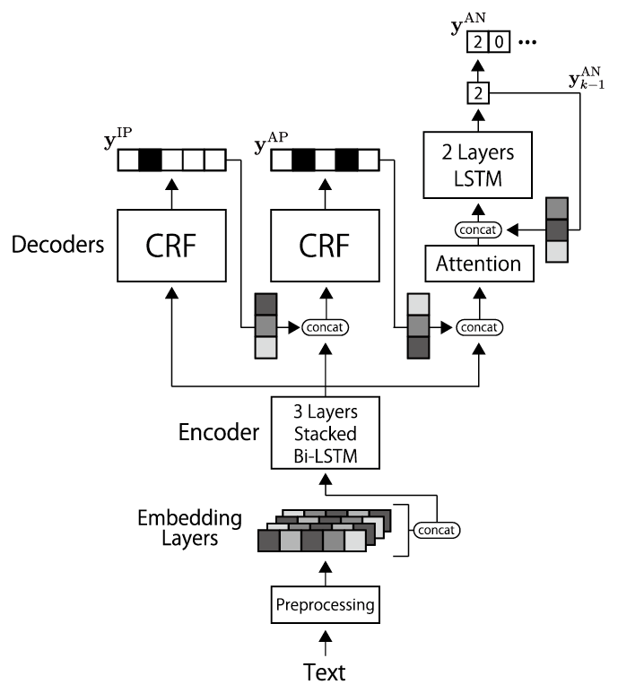
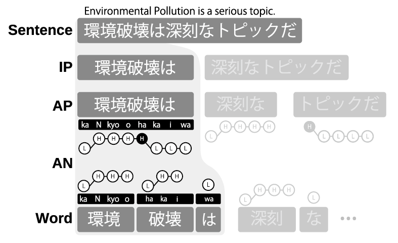

Submitted to Interspeech 2022

### Authors

- Byeongseon Park
- Ryuichi Yamamoto
- Kentaro Tachibana

 

### Abstract

We propose a unified accent estimation method for Japanese text-to-speech (TTS).
Unlike the conventional two-stage methods, which separately train two models for predicting accent phrase boundaries and accent nucleus positions, our method merges the two models and jointly optimizes the entire model in a multi-task learning framework.
Furthermore, considering the hierarchical linguistic structure of intonation phrases (IPs), accent phrases, and accent nuclei, we generalize the proposed approach to simultaneously model the IP boundaries with accent information.
Objective evaluation results reveal that the proposed method achieves an accent estimation accuracy of 80.4%, which is 6.67% higher than the conventional two-stage method.
When the proposed method is incorporated into a neural TTS framework, the system achieves a 4.29 mean opinion score with respect to prosody naturalness.

 

### Demo

#### TTS setup

- **Acoustic model** : **FastSpeech2** [[1](https://arxiv.org/abs/2006.04558)]
- **Vocoder** : **Parallel WaveGAN** [[2](https://arxiv.org/abs/1910.11480)]

The detailed model structure and training conditions of these two models were the same as those in [[3](https://arxiv.org/abs/2010.14151)].

#### Target tasks

- **IPs** : Intonation phrases
- **APs** : Accent phrases
- **ANs** : Accent nuclei

 

#### Systems used for comparision

##### Models

| Model	| Encoder	| Decoder	| Task |
| ----- | ------ | ---- | ---- |
| (a)[[4](https://www.jstage.jst.go.jp/article/transinf/E100.D/4/E100.D_2016AWI0004/_article)]	| -				| CRF			| **AP** 		|
| (b)[[4](https://www.jstage.jst.go.jp/article/transinf/E100.D/4/E100.D_2016AWI0004/_article)]	| -				| CRF			| **AN** 		|
| (c)																							| Bi-LSTM		| CRF			| **IP**		|
| (d)																							| Bi-LSTM		| CRF			| **AP**		|
| (e)																							| Bi-LSTM		| AR			| **AN**		|
| (f)																							| Bi-LSTM		| CRF, AR		| **AP+AN**		|
| (g)																							| Bi-LSTM		| CRF, CRF, AR	| **IP+AP+AN**	|

##### Systems

| System						| Components	|
| ------------- 				| ------------- |
| Reference (Recording) [^1]	| -				|
| Reference (TTS) [^2]			| -				|
| (A)							| (a), (b), (c) |
| (B)							| (c), (d), (e)	|
| (C)							| (c), (f)		|
| (D)							| (g)			|

[^2]: Recorded speech.
[^1]: Synthesized speech using human-annotated prosody information.

<!-- ##### Systems used for comparision

- **Reference (Recording)** : Recorded speech.
- **Reference (TTS)** : Recorded speech.
- **Syste(A)**:  The system combined three single-task based models, included two CRF-based models for **AP** and **AN** [[4](https://www.jstage.jst.go.jp/article/transinf/E100.D/4/E100.D_2016AWI0004/_article)].
- **Syste(B)**:  The system combined three single-task based models.
- **Syste(C)**: The system combined a single-task based model for **IP** task and a dual-task based model for **AP** and **AN** tasks.
- **Syste(D)**: The system used a triple-task based model. -->

##### Audio samples (Japanese)

Sample 1: **"翌々日１６日夕方の奈良県河合町の降水確率は９０パーセントです。"**

| Reference (Recording)	| Reference (TTS) | System(A)				|
|-----------------------|-----------------------|-----------------------|
| <audio controls src="https://6gsn.github.io/demos/samples/systems/sample01/record.wav"></audio> | <audio controls src="https://6gsn.github.io/demos/samples/systems/sample01/tts.wav"></audio> | <audio controls src="https://6gsn.github.io/demos/samples/systems/sample01/taset.wav"></audio> |

 System(B)				| System(C)				| System(D) (proposed)	|
|-----------------------|-----------------------|-----------------------|
| <audio controls src="https://6gsn.github.io/demos/samples/systems/sample01/single.wav"></audio> | <audio controls src="https://6gsn.github.io/demos/samples/systems/sample01/dual.wav"></audio> | <audio controls src="https://6gsn.github.io/demos/samples/systems/sample01/triple.wav"></audio> |

 

Sample 2: **"立ち続けてましたからね。"**

| Reference (Recording)	| Reference (TTS) | System(A)				|
|-----------------------|-----------------------|-----------------------|
| <audio controls src="https://6gsn.github.io/demos/samples/systems/sample02/record.wav"></audio> | <audio controls src="https://6gsn.github.io/demos/samples/systems/sample02/tts.wav"></audio> | <audio controls src="https://6gsn.github.io/demos/samples/systems/sample02/taset.wav"></audio> |

 System(B)				| System(C)				| System(D) (proposed)	|
|-----------------------|-----------------------|-----------------------|
| <audio controls src="https://6gsn.github.io/demos/samples/systems/sample02/single.wav"></audio> | <audio controls src="https://6gsn.github.io/demos/samples/systems/sample02/dual.wav"></audio> | <audio controls src="https://6gsn.github.io/demos/samples/systems/sample02/triple.wav"></audio> |

 

Sample 3: **"最初にすることは早起き、次にするのが二度寝、その次が後悔。"**

| Reference (Recording)	| Reference (TTS) | System(A)				|
|-----------------------|-----------------------|-----------------------|
| <audio controls src="https://6gsn.github.io/demos/samples/systems/sample03/record.wav"></audio> | <audio controls src="https://6gsn.github.io/demos/samples/systems/sample03/tts.wav"></audio> | <audio controls src="https://6gsn.github.io/demos/samples/systems/sample03/taset.wav"></audio> |

 System(B)				| System(C)				| System(D) (proposed)	|
|-----------------------|-----------------------|-----------------------|
| <audio controls src="https://6gsn.github.io/demos/samples/systems/sample03/single.wav"></audio> | <audio controls src="https://6gsn.github.io/demos/samples/systems/sample03/dual.wav"></audio> | <audio controls src="https://6gsn.github.io/demos/samples/systems/sample03/triple.wav"></audio> |

 

Sample 4: **"タケノリの、ブラディミールさんですね。"**

| Reference (Recording)	| Reference (TTS) | System(A)				|
|-----------------------|-----------------------|-----------------------|
| <audio controls src="https://6gsn.github.io/demos/samples/systems/sample04/record.wav"></audio> | <audio controls src="https://6gsn.github.io/demos/samples/systems/sample04/tts.wav"></audio> | <audio controls src="https://6gsn.github.io/demos/samples/systems/sample04/taset.wav"></audio> |

 System(B)				| System(C)				| System(D) (proposed)	|
|-----------------------|-----------------------|-----------------------|
| <audio controls src="https://6gsn.github.io/demos/samples/systems/sample04/single.wav"></audio> | <audio controls src="https://6gsn.github.io/demos/samples/systems/sample04/dual.wav"></audio> | <audio controls src="https://6gsn.github.io/demos/samples/systems/sample04/triple.wav"></audio> |

 

Sample 5: **"足りないよりもずっと良いと思いますよ。"**

| Reference (Recording)	| Reference (TTS) | System(A)				|
|-----------------------|-----------------------|-----------------------|
| <audio controls src="https://6gsn.github.io/demos/samples/systems/sample05/record.wav"></audio> | <audio controls src="https://6gsn.github.io/demos/samples/systems/sample05/tts.wav"></audio> | <audio controls src="https://6gsn.github.io/demos/samples/systems/sample05/taset.wav"></audio> |

 System(B)				| System(C)				| System(D) (proposed)	|
|-----------------------|-----------------------|-----------------------|
| <audio controls src="https://6gsn.github.io/demos/samples/systems/sample05/single.wav"></audio> | <audio controls src="https://6gsn.github.io/demos/samples/systems/sample05/dual.wav"></audio> | <audio controls src="https://6gsn.github.io/demos/samples/systems/sample05/triple.wav"></audio> |

 
 

#### States used for comparision

- **Recording** : Recorded speech.
- **X**: The speech synthesised using wrong **IP**, **AP**, and **AN** information.
- **IP**: The speech synthesised using correct **IP** information, with wrong **AP** and **AN**.
- **AP**: The speech synthesised using correct **AP** information, with wrong **IP** and **AN**.
- **AN**: The speech synthesised using correct **AN** information, with wrong **IP** and **AP**.
- **IP+AP**: The speech synthesised using correct **IP** and **AP** information, with wrong **AN**.
- **AP+AN**: The speech synthesised using correct **AP** and **AN** information, with wrong **IP**.
- **IP+AP+AN**:  The speech synthesised using correct **IP**, **AP**, and **AN** information.

 

##### Audio samples (Japanese)

Sample 1

| Recording			| X						| IP					|
|-----------------------|-----------------------|-----------------------|
| <audio controls src="https://6gsn.github.io/demos/samples/tasks/sample01/ground.wav"></audio> | <audio controls src="https://6gsn.github.io/demos/samples/tasks/sample01/x.wav"></audio> | <audio controls src="https://6gsn.github.io/demos/samples/tasks/sample01/ip.wav"></audio> |

| AP					| AN					| IP+AP					|
|-----------------------|-----------------------|-----------------------|
| <audio controls src="https://6gsn.github.io/demos/samples/tasks/sample01/ap.wav"></audio> | <audio controls src="https://6gsn.github.io/demos/samples/tasks/sample01/an.wav"></audio> | <audio controls src="https://6gsn.github.io/demos/samples/tasks/sample01/ip_ap.wav"></audio> |

| AP+AN					| IP+AP+AN				|
|-----------------------|-----------------------|
| <audio controls src="https://6gsn.github.io/demos/samples/tasks/sample01/ap_an.wav"></audio> | <audio controls src="https://6gsn.github.io/demos/samples/tasks/sample01/ip_ap_an.wav"></audio> |

 

Sample 2

| Recording			| X						| IP					|
|-----------------------|-----------------------|-----------------------|
| <audio controls src="https://6gsn.github.io/demos/samples/tasks/sample02/ground.wav"></audio> | <audio controls src="https://6gsn.github.io/demos/samples/tasks/sample02/x.wav"></audio> | <audio controls src="https://6gsn.github.io/demos/samples/tasks/sample02/ip.wav"></audio> |

| AP					| AN					| IP+AP					|
|-----------------------|-----------------------|-----------------------|
| <audio controls src="https://6gsn.github.io/demos/samples/tasks/sample02/ap.wav"></audio> | <audio controls src="https://6gsn.github.io/demos/samples/tasks/sample02/an.wav"></audio> | <audio controls src="https://6gsn.github.io/demos/samples/tasks/sample02/ip_ap.wav"></audio> |

| AP+AN					| IP+AP+AN				|
|-----------------------|-----------------------|
| <audio controls src="https://6gsn.github.io/demos/samples/tasks/sample02/ap_an.wav"></audio> | <audio controls src="https://6gsn.github.io/demos/samples/tasks/sample02/ip_ap_an.wav"></audio> |

 

Sample 3

| Recording			| X						| IP					|
|-----------------------|-----------------------|-----------------------|
| <audio controls src="https://6gsn.github.io/demos/samples/tasks/sample03/ground.wav"></audio> | <audio controls src="https://6gsn.github.io/demos/samples/tasks/sample03/x.wav"></audio> | <audio controls src="https://6gsn.github.io/demos/samples/tasks/sample03/ip.wav"></audio> |

| AP					| AN					| IP+AP					|
|-----------------------|-----------------------|-----------------------|
| <audio controls src="https://6gsn.github.io/demos/samples/tasks/sample03/ap.wav"></audio> | <audio controls src="https://6gsn.github.io/demos/samples/tasks/sample03/an.wav"></audio> | <audio controls src="https://6gsn.github.io/demos/samples/tasks/sample03/ip_ap.wav"></audio> |

| AP+AN					| IP+AP+AN				|
|-----------------------|-----------------------|
| <audio controls src="https://6gsn.github.io/demos/samples/tasks/sample03/ap_an.wav"></audio> | <audio controls src="https://6gsn.github.io/demos/samples/tasks/sample03/ip_ap_an.wav"></audio> |

 
 

### References

- \[1\]: Y. Ren, C. Hu, X. Tan, S. Zhao, Z. Zhao, and T.Y. Liu, “FastSpeech 2: Fast and high-quality end-to-end text-to-speech,” in Proc. ICLR, 2021 ([arXiv](https://arxiv.org/abs/2006.04558)).
- \[2\]: R. Yamamoto, E. Song, and J.-M. Kim, “Parallel WaveGAN: A fast waveform generation model based on generative adversarial networks with multi-resolution spectrogram,” in Proc. ICASSP, 2020, pp. 6199–6203 ([arXiv](https://arxiv.org/abs/1910.11480)).
- \[3\]: R. Yamamoto, E. Song, M.-J. Hwang, and J.-M. Kim, “Parallel waveform synthesis based on generative adversarial networks with voicing-aware conditional discriminators,” in Proc. ICASSP, 2021, pp. 6039–6043 ([arXiv](https://arxiv.org/abs/2010.14151)).
- \[4\]: M. Suzuki, R. Kuroiwa, K. Innami, S. Kobayashi, S. Shimizu, N. Minematsu, and K. Hirose, “Accent sandhi estimation of Tokyo dialect of Japanese using conditional random fields,” IEICE Trans., vol. E100-D, no. 4, pp. 655–661, 2017 ([IEICE](https://www.jstage.jst.go.jp/article/transinf/E100.D/4/E100.D_2016AWI0004/_article)).

 

### Acknowledgements
This work was supported by Clova Voice, NAVER Corp., Seongnam, Korea.
The authors would like to thank Yuma Shirahata and Kosuke Futamata at LINE Corp., Tokyo, Japan, for their support.
